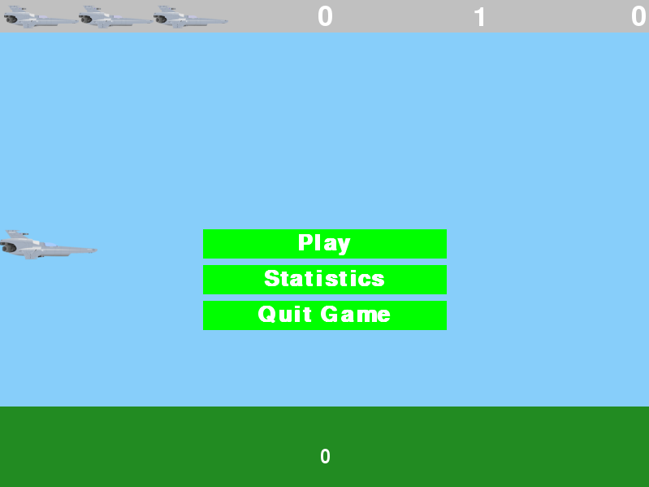
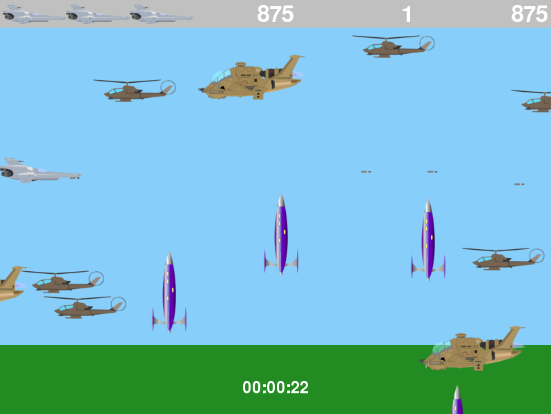
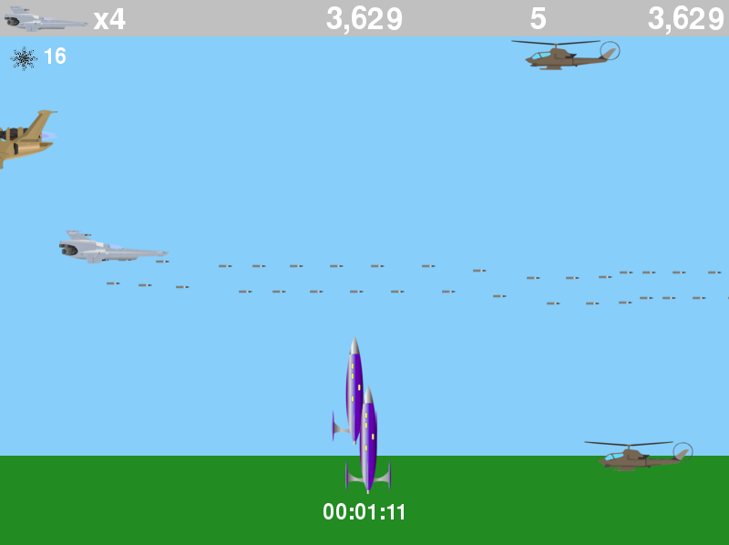
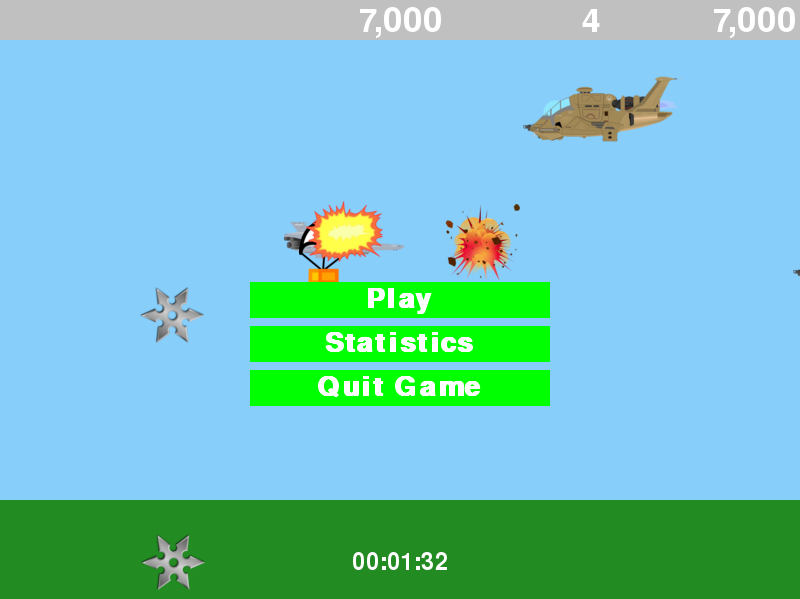

# Plain Planes

You control an aircraft to shoot down other aircrafts. Game includes a myriad of hostile aircrafts. An upgrade drop will appear after shooting down an advanced helicopter. By moving your aircraft over the airdrop, you stand a chance of getting the increased rate of fire, secondary minigun activation, missile or laser upgrade.

&nbsp;
## Characteristics
- Vector graphics acquired from Pixabay.
- Game written in Python and pygame.

&nbsp;
## Task
Create a simple game after reading Python Crash Course by Eric Matthes. Inspired heavily by my childhood game, [Platypus](http://store.steampowered.com/app/307340/Platypus/).

&nbsp;
## Screenshots of the Game
### Main Menu

&nbsp;
### Hostiles

&nbsp;
### Upgrade Drops

&nbsp;
### Upgrades

&nbsp;
### Game End

&nbsp;
&nbsp;
### Running the game
Execute run_game.py.

&nbsp;
### License
This project is licensed under The GNU General Public License v3.0 - see the [LICENSE.md](LICENSE.md) file for details.

ShipBullet Sound by Jim Rogers from [soundbible.com](http://soundbible.com/)

Explosion Sound [zapsplat.com](https://www.zapsplat.com/)

ShipMissile Sound [zapsplat.com](https://www.zapsplat.com/)

All images are taken from [Pixabay](https://pixabay.com/)

Pixabay is a vibrant community of creatives, sharing copyright free images and videos. All contents are released under Creative Commons CC0, which makes them safe to use without asking for permission or giving credit to the artist - even for commercial purposes.

&nbsp;
### Acknowledgments
- [Eric Matthes](https://ehmatthes.github.io/)

